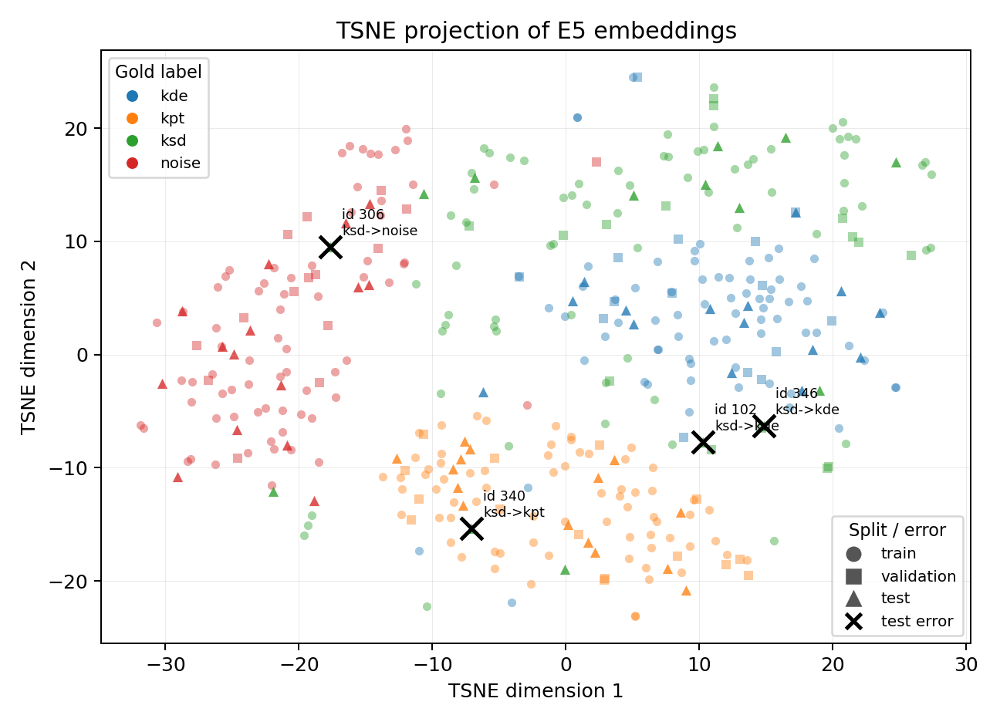

# Paleography Web Text Triage Classifier

Embedding-based classifier for routing short web text snippets related to Ancient Chinese paleography. The system classifies a snippet as scholarly discussion, primary transcription, dictionary/reference content, or noise for corpus construction.

The model is intended mainly for Chinese paleography-related text. The demo interface supports English and Chinese UI text, but the training and evaluation data are Chinese.

## Links

- Dataset: https://huggingface.co/datasets/Harry214/paleography-web-text-triage-dataset
- Model: https://huggingface.co/Harry214/paleography-web-text-triage-logreg
- Space demo: https://huggingface.co/spaces/Harry214/paleography-web-text-triage-demo

## Repository Structure

```text
data/
  raw/
    collected_snippets.csv      # manually collected source snippets
  processed/
    cleaned_snippets.csv
    train.csv
    validation.csv
    test.csv
    *_embeddings.npy            # generated embedding arrays
models/
  average_baseline.joblib
  logistic_regression.joblib   # final demo classifier
  linear_svm.joblib
  label_encoder.joblib
  label_mapping.json
results/
  *_metrics.csv
  *_report.txt
  *_confusion_matrix.csv
  *_errors.csv
src/
  app.py
  average_baseline.py
  embedding_utils.py
  logistic_regression.py
  plot_embedding_distribution.py
  prepare_data.py
  svm.py
report/
  bilingual_examples.md
  report.pdf
  report_full.tex
  figures/
    embedding_distribution_pca.*
    embedding_distribution_tsne.*
app.py                         # Hugging Face Space entry point
annotation_guidelines.md
requirements.txt
README.md
source_used.md
```

## Environment

Install dependencies:

```bash
pip install -r requirements.txt
```

During development, the project was run in a Conda environment named `lt`:

```bash
conda activate lt
```

## Run the Demo

Run locally:

```bash
python app.py
```

Or with the development interpreter:

```bash
/home/huanyu/miniconda3/envs/lt/bin/python app.py
```

Then open:

```text
http://127.0.0.1:7860
```

## Dataset

The dataset contains 400 manually labeled Chinese snippets collected from public paleography-related web sources and reference pages. Each row contains:

- `id`
- `text`
- `label`
- `source_url`
- `language`

Splits:

| Split | Rows | Per-label distribution |
|---|---:|---|
| Train | 280 | 70 per label |
| Validation | 60 | 15 per label |
| Test | 60 | 15 per label |
| Total | 400 | 100 per label |

Labels:

| Short label | Full label | Meaning |
|---|---|---|
| `ksd` | `keep_scholarly_discussion` | Scholarly or research-oriented paleography discussion. |
| `kpt` | `keep_primary_transcription` | Primary inscription, oracle-bone, bronze, or manuscript transcription. |
| `kde` | `keep_dictionary_entry` | Dictionary-style or reference-style character/word entry. |
| `noise` | `discard_noise_irrelevant` | Navigation, metadata, irrelevant text, broken OCR, or other noise. |

Metadata and catalogue records were not used as a separate label because they are highly structured and are better handled by field extraction or table/database processing.

## Model

The system uses `intfloat/multilingual-e5-small` to encode each snippet with the E5-style prefix:

```text
passage: {text}
```

Embeddings are normalized and saved under `data/processed/` when the training/evaluation scripts are run:

- `train_embeddings.npy`
- `validation_embeddings.npy`
- `test_embeddings.npy`

Three classifiers were trained on top of the embeddings:

1. Average embedding baseline
2. Logistic Regression
3. Linear SVM

The final Gradio demo uses Logistic Regression because it tied with Linear SVM on the test set and supports class probabilities through `predict_proba`.

## Evaluation

| Model | Validation Accuracy | Validation Macro F1 | Test Accuracy | Test Macro F1 |
|---|---:|---:|---:|---:|
| Logistic Regression | 0.8500 | 0.8433 | 0.9333 | 0.9298 |
| Linear SVM | 0.8667 | 0.8623 | 0.9333 | 0.9298 |
| Average Embedding Baseline | 0.8667 | 0.8666 | 0.9167 | 0.9141 |

Detailed metrics, classification reports, confusion matrices, and error files are stored in `results/`.

Embedding visualizations are stored in `report/figures/`. The t-SNE plot marks the four Logistic Regression test errors with black crosses:



## Reproduce

Prepare the cleaned data and splits:

```bash
python src/prepare_data.py
```

Train and evaluate the classifiers:

```bash
python src/average_baseline.py --eval-split validation
python src/average_baseline.py --eval-split test

python src/logistic_regression.py --eval-split validation
python src/logistic_regression.py --eval-split test

python src/svm.py --eval-split validation
python src/svm.py --eval-split test
```

The scripts reuse existing embedding files unless `--force-embeddings` is passed.

Generate PCA and t-SNE visualizations:

```bash
python src/plot_embedding_distribution.py
```

## Documentation

- `annotation_guidelines.md`: labeling rules and class definitions
- `source_used.md`: source list
- `report/report.pdf`: compiled project report
- `report/report_full.tex`: full LaTeX source for the project report
- `report/bilingual_examples.md`: representative test examples with English glosses

## Privacy and Ethics

The dataset uses public scholarly, reference, transcription, and webpage snippets. It does not intentionally include private or sensitive personal information. The classifier is intended for corpus filtering and research data organization, not for authoritative paleographic interpretation.
